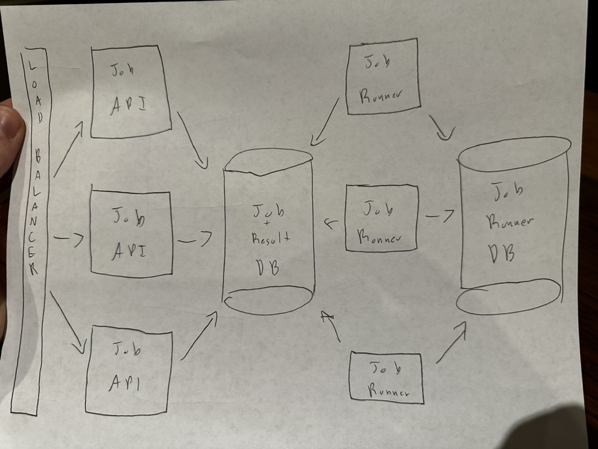

# System Design

## Basic Steps

1) **Clarify and agree on the scope of the system**
* **User cases** (description of sequences of events that, taken together, lead to a system doing something useful)
    * Who is going to use it?
    * How are they going to use it?
* **Constraints**
    * Mainly identify **traffic and data handling** constraints at scale.
    * Scale of the system such as requests per second, requests types, data written per second, data read per second)
    * Special system requirements such as multi-threading, read or write oriented.

2) **High level architecture design (Abstract design)**
  

3) **Component Design**
* Component + specific **APIs** required for each of them.
  * Job REST Endpoints
    * POST job
      * URL: `/jobs`
      * PARAMS: `{ urls: ['url1', 'url2'] }`
      * RETURNS: `{ jobs: [job1, job2] }`
    * GET job
      * URL: `/jobs/{jobId}`
      * RETURNS: `{ id: 1, url: 'jobUrl', status: 'IN_PROGRESS' }`
    * GET job result
        * URL: `/results/{jobId}`
        * RETURNS: `{ id: 1, data: 'JSON' }`
    * DELETE job
      * URL: `/jobs/{jobID}`
      * RETURNS: `204 No Content`
  * DB service
    * `createJob(urls)`
    * `getJob(id)`
    * `createResult(jobId, result)`
    * `deleteJob(jobId)`
  * Job Runner
    * `defineJob`
    * `runJobs`
* **Object oriented design** for functionalities.
    * Map features to modules: One scenario for one module.
    * Consider the relationships among modules:
        * Certain functions must have unique instance (Singletons)
        * Core object can be made up of many other objects (composition).
        * One object is another object (inheritance)
* **Database schema design.**
    ```
        model Job {
              id     Int     @id @default(autoincrement())
              url    String  @db.VarChar(3000)
              status JobStatus  @default(IN_PROGRESS)
              result Result?

              @@index([url])
        }

        model Result {
            id     Int     @id @default(autoincrement())
            job    Job     @relation(fields: [jobId], references: [id])
            jobId  Int     @unique
        }

        enum JobStatus {
            IN_PROGRESS
            COMPLETE
        }
    ```

4) **Understanding Bottlenecks**
  - Job result db will be the main bottleneck. Data can be sharded in the future if needed.

5) **Scaling** your abstract design
* **Vertical scaling**
    * Vertically scale the job/result db until it is cost prohibitive. Then shard.
* **Horizontal scaling**
    * Horizontally scale the job/result api and job runner services.
* **Caching**
    * Possibly cache jobs at the application layer.
    * Possibly cache job results at the application layer.
    * Load balancer request caching?
* **Load balancing**
    * Load balance in front of the job / result API instances.
* **Database replication**
    * Future consideration.
* **Database partitioning**
    * Future consideration.
    * Adding a map-reduce layer makes it possible to perform data and/or processing intensive operations in a reasonable amount of time. You might use it for calculating suggested users in a social graph, or for generating analytics reports. eg. Hadoop, and maybe Hive or HBase.